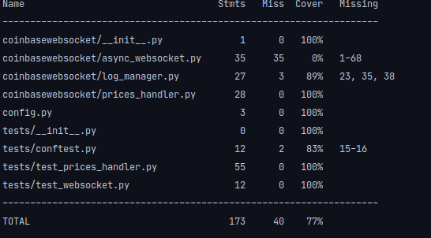

# Websocket for Crypto


### Simple software to get ticks from Coinbase Match Channel, and calculate Vwap

### References:
[`vwap formula`](https://ml.pages.voltaware.com/ml-data-access/mlda.html#mlda.retrieve_smart_cables)

[`coinbase match channel`](https://docs.pro.coinbase.com/#the-matches-channel)

###Development
#### Useful commands:

Poetry install dependencies and create venv:
[`poetry source`](https://python-poetry.org/)
```bash
poetry install --no-interaction --no-ansi
```
[`poetry source`](https://python-poetry.org/)

Format files:
```bash
yapf -i -r --style google --no-local-style -p -vv . --exclude '.venv/*' --exclude '.tox/*'
```

Run unittests:
```bash
pytest -s -vv -x --cov-report term-missing --cov=. tests/
```



## Run websocket vwap on container
 1- In the same folder copy this command to build image:
```bash
docker build -t websocket-async .
```
2- Run this command and start to see the time real vwap:
```bash
docker run websocket-async python coinbasewebsocket/async_websocket.py
```